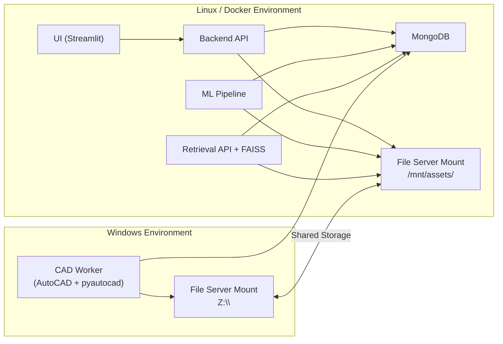
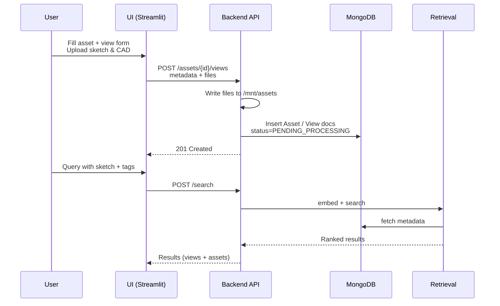
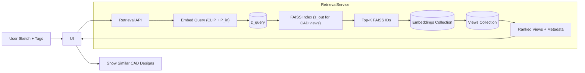

# CAD Retrieval System – Architecture & Flow

This document describes how the CAD retrieval system is structured, how the Linux (containerized) and Windows (AutoCAD) parts interact, and how data flows through the system.

It covers:

1. User interface interaction
2. Storing files in an internal file server
3. Storing metadata and embeddings in MongoDB
4. Project repository & containerization structure
5. Embedding generation and training projection heads
6. Retrieval for a user query (sketch + tags)

---

## 1. High-Level System Overview

The system consists of two major runtime environments:

- **Linux / Docker environment**
  - UI (Streamlit)
  - Backend API (FastAPI/Flask)
  - ML pipeline (embedding + training)
  - Retrieval API (FAISS index)
  - MongoDB
  - Shared file server mounted (e.g. `/mnt/assets`)

- **Windows environment**
  - AutoCAD + pyautocad
  - CAD worker service (`cad_worker_windows`) reading jobs from MongoDB
  - Same shared file server mounted (e.g. `Z:\`)

The two worlds communicate *only* via:

- MongoDB (job state, assets, views, embeddings, models)
- File server (raw CAD, sketches, rasterized views, extracted metadata)

### 1.1 High-level component diagram (Mermaid)



---

## 2. User Interface Interaction

The UI is built in **Streamlit** (`ui/streamlit_app/`) and communicates with the backend API.

### 2.1 Main user flows

1. **Asset creation**
   - User enters:
     - `asset_id` (or it is generated)
     - `client_name`, `project_name`, `category`
     - `created_by`
   - UI sends data to backend → backend creates `Asset` document in MongoDB.

2. **View creation**
   - For each view of an asset:
     - Select `view_type` (elevation, plan, section, etc.)
     - Upload **sketch** image
     - Upload **CAD** file (DWG/DXF)
     - Select tags from a controlled vocabulary (e.g. `["hinged", "corner", "handle-less"]`)
   - UI sends these to the backend.

3. **Backend responsibilities on upload**
   - Accepts uploaded files from UI.
   - Chooses deterministic relative paths:
     - `raw/sketch/{asset_id}/{view_id}.png`
     - `raw/cad/{asset_id}/{view_id}.dwg`
   - Writes files to the shared file server at `/mnt/assets/<rel_path>`.
   - Creates a `View` document in Mongo:
     - Links to the relative paths.
     - Stores tags.
     - Sets `status = "PENDING_PROCESSING"`.

4. **Search / retrieval flow**
   - User uploads a **query sketch** and selects tags.
   - UI sends sketch + tags to the **retrieval API**.
   - Retrieval API:
     - Embeds query (sketch + tags).
     - Searches FAISS for nearest CAD views.
     - Returns metadata & display info to UI.
   - UI shows thumbnails and metadata for matching CAD designs.

### 2.2 UI request/response flow (Mermaid)



---

## 3. Storing Files in the File Server

You use an **internal file server** (e.g. NAS).

- On **Linux**: mounted at `/mnt/assets`
- On **Windows**: mounted at `Z:\`

### 3.1 Directory structure (relative paths)

All services agree on a **logical structure** (relative paths):

```text
raw/
  sketch/{asset_id}/{view_id}.png
  cad/{asset_id}/{view_id}.dwg

processed/
  raster/{asset_id}/{view_id}.png
  metadata/{asset_id}/{view_id}.json

models/
  projection_heads/{version}/weights.pt
  faiss_index/{version}/index.faiss
```

- Backend writes **raw** files when user uploads.
- Windows CAD worker writes **processed** files (raster + metadata).
- ML pipeline and Retrieval APIs **read** from these paths.

The absolute path on Linux:

- `/mnt/assets/raw/cad/A_001/V_001.dwg`

The absolute path on Windows:

- `Z:\raw\cad\A_001\V_001.dwg`

In MongoDB, you only store the **relative path** like:  
`raw/cad/A_001/V_001.dwg`

---

## 4. Storing Metadata in MongoDB

MongoDB is the source of truth for:

- Assets
- Views
- Processing jobs
- Embeddings
- Model versions

### 4.1 Collections and schema sketches

#### `assets`

```json
{
  "_id": "A_001",
  "client_name": "ClientX",
  "project_name": "Wardrobe_Set_01",
  "category": "wardrobe",
  "created_by": "designer_01",
  "tags": ["wardrobe", "bedroom"],
  "created_at": "2025-11-18T10:00:00Z",
  "updated_at": "2025-11-18T10:00:00Z"
}
```

#### `views`

```json
{
  "_id": "V_001",
  "asset_id": "A_001",
  "view_type": "elevation",

  "files": {
    "sketch":   { "rel_path": "raw/sketch/A_001/V_001.png",  "content_type": "image/png" },
    "cad":      { "rel_path": "raw/cad/A_001/V_001.dwg",     "content_type": "application/acad" },
    "raster":   { "rel_path": "processed/raster/A_001/V_001.png",   "content_type": "image/png" },
    "metadata": { "rel_path": "processed/metadata/A_001/V_001.json", "content_type": "application/json" }
  },

  "tags": ["hinged", "two-door"],

  "status": "PENDING_PROCESSING",

  "created_at": "2025-11-18T10:05:00Z",
  "updated_at": "2025-11-18T10:05:00Z"
}
```

#### `processing_jobs` (optional)

```json
{
  "_id": "J_1001",
  "view_id": "V_001",
  "type": "CAD_PROCESSING",
  "status": "PENDING",      // PENDING | IN_PROGRESS | DONE | FAILED
  "error": null,
  "created_at": "2025-11-18T10:05:00Z",
  "updated_at": "2025-11-18T10:05:00Z"
}
```

#### `embeddings`

```json
{
  "_id": "E_001",
  "view_id": "V_001",
  "asset_id": "A_001",
  "model_version": "v1.0",

  "input_embedding": {
    "vector": [0.1, 0.2, 0.3, "..."],
    "dim": 1024
  },

  "output_embedding": {
    "vector": [0.05, 0.12, 0.8, "..."],
    "dim": 1024,
    "faiss_id": 12345
  },

  "created_at": "2025-11-18T12:00:00Z",
  "updated_at": "2025-11-18T12:00:00Z"
}
```

#### `models`

```json
{
  "_id": "projection_heads_v1.0",
  "type": "projection_heads",
  "version": "v1.0",
  "storage": {
    "rel_path": "models/projection_heads/v1.0/weights.pt"
  },
  "created_at": "2025-11-18T11:30:00Z",
  "notes": "First trained projection heads"
}
```

---

## 5. Project Repository Structure & Containerization

The monorepo structure:

```text
repo/
  ui/
    streamlit_app/
      app.py
      pages/
      components/
      services/           # client libs to talk to backend API

  backend/
    api/
      main.py             # FastAPI / Flask
      routes/
        assets.py
        views.py
        search.py
    core/
      config.py
      logging.py
    db/
      mongo_client.py
      models/             # Pydantic / ODM models
    storage/
      base.py             # StorageBackend interface
      filesystem.py       # FileSystemStorageBackend
    services/
      asset_service.py
      view_service.py
      job_service.py

  cad_worker_windows/
    main.py               # polling loop for jobs
    autocad_client.py     # pyautocad wrappers
    rasterize.py
    extract_metadata.py
    config.py

  ml/
    data/
      dataset_builder.py  # reads from Mongo + file server
    models/
      clip_backbone.py
      input_head.py
      output_head.py
    training/
      train_contrastive.py
      losses.py
      scheduler.py
    evaluation/
      recall_at_k.py
      test_suite.py

  retrieval/
    index/
      build_index.py      # builds FAISS index
      index_wrapper.py    # loads FAISS, search API
    api/
      main.py             # retrieval service
    client/
      retrieval_client.py # used by backend / UI

  infra/
    docker/
      Dockerfile.backend
      Dockerfile.ui
      Dockerfile.ml
      Dockerfile.retrieval
      docker-compose.yml
    k8s/                  # optional for later

  docs/
    architecture.md
    high_level_design.md
```

### 5.1 Containerized services (Linux)

Under `infra/docker/docker-compose.yml`, you typically run:

- `mongo` – official Mongo image
- `backend` – from `Dockerfile.backend`
- `ui` – from `Dockerfile.ui`
- `retrieval` – from `Dockerfile.retrieval`
- `ml` – from `Dockerfile.ml` (for batch jobs)
- all with a bind mount to `/mnt/cad_store`

### 5.2 Windows CAD worker

- Uses `cad_worker_windows/` code.
- Runs **outside** Docker on a Windows host with:
  - AutoCAD + pyautocad installed.
  - File server mounted as `Z:\cad_store`.
  - `MONGO_URI` pointing to the same Mongo instance.
- Periodically polls Mongo for `PENDING` jobs and processes them.

---

## 6. Embedding Generation & Training Projection Heads

### 6.1 Encoders

You use a frozen CLIP-like model:

- $f_\text{img}(x)$ → image embedding (dimension $D_\text{img}$)
- $f_\text{txt}(t)$ → text embedding (dimension $D_\text{txt}$)

#### Input (query) side

For each training view / query:

- Sketch image $S_i$
- Tag text $T$ (e.g. `"hinged two-door wardrobe"`)

Compute:

- $e_s = f_\text{img}(S_i)$
- $e_t = f_\text{txt}(T)$

Combine via **concatenation**:

- $E_{in} = [e_s ; e_t]$  
  → dimension $D_{in} = D_\text{img} + D_\text{txt}$

#### Output (CAD) side

For the corresponding CAD view:

- Rasterized CAD image $C_i$
- Metadata text $O_i$ (extracted from CAD)

Compute:

- $e_c = f_\text{img}(C_i)$
- $e_o = f_\text{txt}(O_i)$

Combine via **concatenation**:

- $E_{out} = [e_c ; e_o]$  
  → dimension $D_{out} = D_\text{img} + D_\text{txt}$ (same as $D_{in}$ if same encoders).

### 6.2 Projection heads

Two MLPs (separate weights):

$$
P_{in} : \mathbb{R}^{D_{in}} \rightarrow \mathbb{R}^{D_{shared}}
$$

$$
P_{out} : \mathbb{R}^{D_{out}} \rightarrow \mathbb{R}^{D_{shared}}
$$

Outputs:

- $z_{in} = P_{in}(E_{in})$   (query-side embedding)
- $z_{out} = P_{out}(E_{out})$ (CAD-side embedding)

Optionally normalize:

- $z_{in\_norm} = \frac{z_{in}}{||z_{in}||}$
- $z_{out\_norm} = \frac{z_{out}}{||z_{out}||}$

### 6.3 Loss (contrastive)

For a batch of N matched pairs $(E_{in}^i, E_{out}^i)$:

1. Compute:  
    1. $z_{in}^i = P_{in}(E_{in}^i)$
    2. $z_{out}^i = P_{out}(E_{out}^i)$
2. Similarity matrix (e.g. cosine or dot-product):
    1. $S_{ij} = \texttt{sim}(z_{in}^i, z_{out}^j)$
3. InfoNCE-style loss:
    1. Query→CAD:

      $$
      L_\text{in} = -\frac{1}{N} \sum_i \log \frac{\exp(S_{ii}/\tau)}{\sum_j \exp(S_{ij}/\tau)}
      $$

    2. CAD→Query (optional symmetric):

      $$
      L_\text{out} = -\frac{1}{N} \sum_i \log \frac{\exp(S_{ii}/\tau)}{\sum_j \exp(S_{ji}/\tau)}
      $$

    3. Final loss:

      $$
      L = \frac{L_\text{in} + L_\text{out}}{2}
      $$

### 6.4 Training flow

1. `ml/data/dataset_builder.py`:
   - Fetches `views` with `status="READY_FOR_EMBEDDING"`.
   - Resolves file paths using `FILE_BASE_DIR + rel_path`.
   - Loads:
     - Sketch image
     - Rasterized CAD image
     - Tags (text)
     - Metadata text (JSON → description string)

2. `ml/models/`:
   - Wraps CLIP backbone (`clip_backbone.py`).
   - Implements `input_head.py` and `output_head.py` (projection heads).

3. `ml/training/train_contrastive.py`:
   - Builds batches of (E_in, E_out).
   - Runs contrastive training loop.
   - Saves trained heads to `models/projection_heads/{version}/weights.pt` on file server.

4. After training, a **CAD embedding generation job**:
   - Recomputes `z_out` for all views.
   - Stores in `embeddings` collection with `faiss_id` assigned from the FAISS index.

---

## 7. Retrieval for User Query (Sketch + Tags)

### 7.1 Query-time embedding

Steps when user searches:

1. **Input**:
   - Query sketch image $S_\text{query}$.
   - Tags $T_\text{query}$ (same tag vocabulary as training).

2. **Embeddings**:
   - $e_{s_q} = f_\text{img}(S_\text{query})$
   - $e_{t_q} = f_\text{txt}(T_\text{query})$
   - Concatenate: $E_\text{inquery} = [e_{s_q} ; e_{t_q}]$
   - Project: $z_\text{query} = P_{in}(E_\text{inquery})$
   - Normalize: $z_\text{querynorm} = \frac{z_\text{query}}{||z_\text{query}||}$

### 7.2 FAISS retrieval

1. The FAISS index is built over **CAD-side embeddings** $z_{out}$:

   - `retrieval/index/build_index.py`:
     - Reads all `output_embedding.vector` for chosen model version.
     - Inserts them into FAISS index.
     - Saves index file in `models/faiss_index/{version}/index.faiss`.

2. At runtime, `retrieval/api/main.py`:

   - Loads projection heads + FAISS index for specific `model_version`.
   - Handles `/search` requests:
     - Embeds query → `z_query_norm`.
     - `indices, distances = faiss_index.search(z_query_norm, k)`.
     - Maps FAISS `indices` back to `embeddings.view_id` using the `faiss_id` field in MongoDB.
     - For each `view_id`, reads `views` document for metadata and `raster` path.

3. Returns ranked results to the UI:

```json
[
  {
    "view_id": "V_001",
    "asset_id": "A_001",
    "score": 0.95,
    "view_type": "elevation",
    "tags": ["hinged", "two-door"],
    "raster_rel_path": "processed/raster/A_001/V_001.png"
  },
  {
    "view_id": "V_010",
    "asset_id": "A_005",
    "score": 0.91,
    "view_type": "plan",
    "tags": ["hinged", "corner"],
    "raster_rel_path": "processed/raster/A_005/V_010.png"
  }
]
```

The UI then:

- Combines `raster_rel_path` with `FILE_BASE_DIR` (or serves through a small file-serving endpoint).
- Renders thumbnails and basic metadata for the user.

### 7.3 Retrieval flow diagram (Mermaid)



---

## 8. Summary

- **UI** (Streamlit) talks only to backend/retrieval APIs; never directly to Mongo or file server.
- **Backend** handles asset and view creation, writes raw files to the file server, and updates Mongo accordingly.
- **Windows CAD worker** (non-containerized) processes CAD into raster + metadata, writes them back to the file server, and updates view status in Mongo.
- **ML pipeline** trains projection heads using concatenated CLIP embeddings (image ⊕ text) on both input and CAD sides.
- **Retrieval service**:
  - Embeds query sketch + tags using the input projection head.
  - Uses FAISS over CAD-side embeddings.
  - Returns ranked CAD views from Mongo, rendered in the UI.
